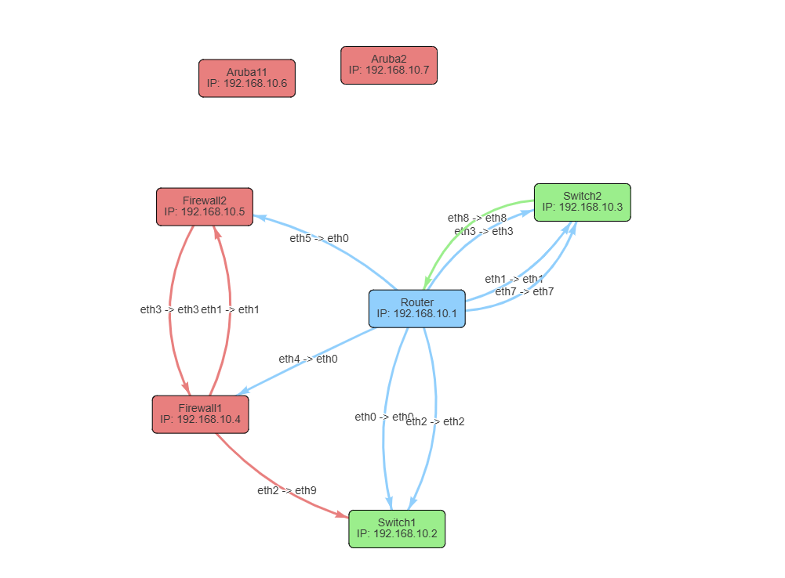

# Heic Converter
A Simple And Cute Looking Network Diagram Built In Python With Flask and HTML, CSS, JS

# Author
Dalibor Jovanovic

# Download & Setup
```
git clone https://github.com/9dali7/NetworkDiagram.git \
cd NetworkDiagram 
```

I suggest to create a folder inside "/var/www/NetworkDiagram"
and then with crontab set a cronjob to start the flask app:

```
@reboot * * * /var/www/NetworkDiagram/app.py &
```

# Pip Setup
```
pip install -r requirements.txt
```

# Diagram Setup
In Order To Generate The Network Diagram Edit The data.yaml File And The Diagram Will Update With The New Data

# Screenshot

